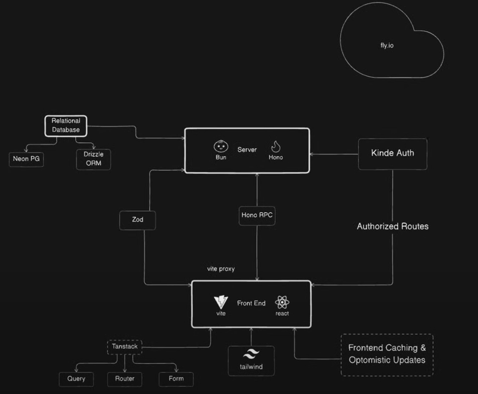

# Expense Tracker

Fullstack web application following the tutorial from 
[Sam Meech-Ward](https://www.youtube.com/watch?v=jXyTIQOfTTk)

# Frameworks

This diagram was drawn by Sam Meech-Ward using [eraser.io](https://www.eraser.io/)

Server
- [Bun](https://bun.sh/)
- [Hono](https://hono.dev/)

Frontend
- [vite](https://vitejs.dev/)
- [react](https://react.dev/)

Styles
- [tailwind](https://tailwindcss.com/)

Query/Router/Form
- [Tanstack](https://tanstack.com/)

Validation
- [Zod](https://zod.dev/)

Authentification
- [Kinde Auth](https://kinde.com/)

Database
- [Neon PostGres](https://neon.tech/)
- [Drizzle ORM](https://orm.drizzle.team/) react to relational database from typescript

Deployment
- [fly.io](https://fly.io/)